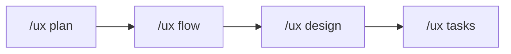

# UX Design - 화면 시안 제안

## 목적

기능 요건을 기반으로 **구체적인 화면 시안**을 제안하고, 기존 디자인 시스템을 활용한 레이아웃과 컴포넌트 조합을 설계합니다.

## 워크플로우



## 실행 절차

### Step 1: 컨텍스트 수집

다음 파일들을 읽어 기존 디자인 시스템 파악:

#### 필수 참조 파일

```bash
# 1. 기능 요구사항
.ux-docs/FUNCTIONAL_REQUIREMENTS.md

# 2. 사용자 플로우
.ux-docs/USER_FLOWS.md

# 3. 디자인 시스템 확인 (우선순위)
# 3-1. 프로젝트 기존 디자인 시스템 확인
package.json                     # MUI, Ant Design, Chakra UI 등 확인
components/ui/                    # 기존 UI 컴포넌트 확인

# 3-2. shadcn/ui 사용 (React/Next.js + 기존 시스템 없는 경우)
.claude/skills/shadcn-ui.md       # shadcn 컴포넌트 참조

# 3-3. 일반 디자인 토큰 (그 외의 경우)
.ux-docs/DESIGN_TOKENS.md        # 색상, 타이포, 간격
.ux-docs/UX_PATTERNS.md          # 기존 UX 패턴

# 4. 프로젝트 컨텍스트
.ux-docs/PROJECT_CONTEXT.md
```

### Step 2: 화면 목록 정의

기능 요구사항과 사용자 플로우를 분석하여 필요한 화면 목록 작성:

```markdown
## 화면 목록

| ID | 화면명 | 타입 | 우선순위 | 설명 |
|----|--------|------|---------|------|
| SC-001 | 대시보드 메인 | 조회 | P0 | 전체 현황 한눈에 보기 |
| SC-002 | 상세 설정 | 입력/수정 | P0 | 설정 변경 |
| SC-003 | 확인 모달 | 확인 | P1 | 작업 확인 |
| SC-004 | 에러 상태 | 에러 | P1 | 실패 시 안내 |
```

**화면 타입**:
- **조회**: 데이터 표시, 대시보드
- **입력/수정**: 폼, 설정
- **확인**: 모달, 토스트
- **에러**: 에러 상태, 빈 상태

### Step 3: 각 화면별 시안 제안

각 화면마다 다음 구조로 제안:

#### 화면 시안 템플릿

```markdown
### [SC-001] 대시보드 메인

#### 📱 레이아웃 구조

+------------------------------------------+
|  Header                                  |
|  [타이틀]                    [액션버튼]   |
+------------------------------------------+
|                                          |
|  Main Content Area                       |
|                                          |
|  +----------------+  +----------------+  |
|  | Card 1         |  | Card 2         |  |
|  | - 지표 A       |  | - 지표 B       |  |
|  | - 수치         |  | - 수치         |  |
|  +----------------+  +----------------+  |
|                                          |
|  +------------------------------------+  |
|  | Table / List                       |  |
|  | - 항목 1                           |  |
|  | - 항목 2                           |  |
|  +------------------------------------+  |
|                                          |
+------------------------------------------+
|  Footer / Pagination                     |
+------------------------------------------+

#### 🎨 사용 컴포넌트

<!-- React/Next.js 프로젝트인 경우 shadcn/ui 컴포넌트 사용 -->
**shadcn/ui 컴포넌트 (React 프로젝트)**:
- `Card` + `CardHeader` + `CardContent` - 카드 레이아웃
- `Table` + `TableHeader` + `TableBody` - 데이터 테이블
- `Button` - variant="default|secondary|outline"
- `Badge` - 상태 표시용
- `Skeleton` - 로딩 상태

<!-- 기존 디자인 시스템이 있는 경우 -->
**기존 디자인 시스템에서 재사용**:
- `Header` - navigation 타입
- `Card` - summary 타입
- `Table` - sortable 타입
- `Button` - primary, secondary

**신규 필요 컴포넌트**:
- `MetricCard` - 지표 표시용 카드
  - Props: title, value, trend, icon
  - 변형: default, highlighted

#### 📝 화면 요소

| 영역 | 요소 | 레이블/텍스트 | 동작 |
|------|------|--------------|------|
| Header | 타이틀 | "대시보드" | - |
| Header | 새로고침 버튼 | "새로고침" | 데이터 갱신 |
| Card 1 | 지표명 | "활성 사용자" | - |
| Card 1 | 수치 | "1,234" | - |
| Card 1 | 변화량 | "+12% ↑" | 색상: success |
| Table | 컬럼 헤더 | "이름", "상태", "수정일" | 정렬 가능 |
| Table | 행 | 데이터 목록 | 클릭 시 상세 |
| Footer | 페이지네이션 | "1 / 10" | 페이지 이동 |

#### 🎯 인터랙션

1. **초기 로드**
   - 로딩 스피너 표시
   - 데이터 로드 완료 시 fade-in

2. **새로고침**
   - 버튼 클릭 → 데이터 재요청
   - 로딩 중 버튼 비활성화

3. **테이블 정렬**
   - 컬럼 헤더 클릭 → 오름차순/내림차순 전환
   - 정렬 상태 아이콘 표시 (↑/↓)

4. **행 클릭**
   - 상세 페이지로 이동
   - 또는 사이드 패널 열기

#### ⚠️ 상태별 화면

**1. 로딩 중**
```
+------------------------------------------+
|  [타이틀]                                 |
+------------------------------------------+
|                                          |
|            [로딩 스피너]                  |
|         "데이터를 불러오는 중..."          |
|                                          |
+------------------------------------------+
```

**2. 데이터 없음 (Empty State)**
```
+------------------------------------------+
|  [타이틀]                    [새로고침]   |
+------------------------------------------+
|                                          |
|              [아이콘]                     |
|        "아직 데이터가 없습니다"            |
|     [+ 새 항목 추가] 버튼                 |
|                                          |
+------------------------------------------+
```

**3. 에러 발생**
```
+------------------------------------------+
|  [타이틀]                    [새로고침]   |
+------------------------------------------+
|                                          |
|            [에러 아이콘]                  |
|      "데이터를 불러올 수 없습니다"         |
|                                          |
|  원인: 서버 응답 없음                     |
|  해결: 네트워크 연결을 확인하세요          |
|                                          |
|          [다시 시도] 버튼                 |
|                                          |
+------------------------------------------+
```

#### 🔍 엣지 케이스

| 케이스 | 화면 처리 |
|--------|----------|
| 데이터 1000개 이상 | 페이지네이션 (20개씩), 가상 스크롤 고려 |
| 숫자가 매우 큼 (1,000,000+) | 1.2M 형식으로 축약 |
| 로딩 시간 3초 이상 | 프로그레스 바 + "30% 완료" 표시 |
| 테이블 컬럼 10개 이상 | 가로 스크롤, 주요 컬럼만 기본 표시 |
| 모바일 화면 | 카드 세로 배치, 테이블 → 리스트 전환 |

#### 📐 디자인 토큰 적용

**색상**:
- Primary: `{DESIGN_TOKENS.md에서 참조}`
- Success: 녹색 (#00C853)
- Error: 빨강 (#D32F2F)
- Background: 흰색/회색

**타이포그래피**:
- 타이틀: Heading-L (24px, Bold)
- 지표 수치: Heading-XL (32px, Bold)
- 본문: Body-M (14px, Regular)

**간격**:
- 카드 간격: spacing-lg (24px)
- 내부 여백: spacing-md (16px)
- 요소 간격: spacing-sm (8px)

#### ✅ 접근성 체크리스트

- [ ] 색상 대비 4.5:1 이상 (텍스트)
- [ ] 모든 인터랙티브 요소 키보드 접근 가능
- [ ] 이미지/아이콘에 대체 텍스트 (aria-label)
- [ ] 로딩/에러 상태 스크린리더 안내
- [ ] 포커스 표시 명확하게 (outline)

#### 💬 UX 라이팅

**버튼**:
- "새로고침" (O) vs "Refresh" (X) - 한글 우선
- "다시 시도" (O) vs "재시도" (X) - 쉬운 표현

**에러 메시지**:
- 구조: [문제] + [원인] + [해결방법]
- 예: "데이터를 불러올 수 없습니다. 서버 응답이 없습니다. 네트워크 연결을 확인하세요."

**빈 상태**:
- 긍정적 톤: "아직 데이터가 없습니다" (O) vs "데이터 없음" (X)
- 다음 행동 제안: "[+ 새 항목 추가]" 버튼 포함
```

---

### Step 4: 프로토타입 권장사항

#### ASCII 와이어프레임

각 화면을 ASCII 아트로 표현하여 개발자가 바로 이해할 수 있게 작성.

#### Figma 연동 (선택)

```markdown
## Figma 작업 가이드

디자이너는 다음 순서로 작업:

1. **컴포넌트 확인**
   - 기존 디자인 시스템에서 재사용 가능한 컴포넌트 확인
   - 신규 필요 컴포넌트 리스트 확인

2. **와이어프레임 작성**
   - 제안된 레이아웃 기반으로 Low-fidelity 와이어프레임 작성

3. **High-fidelity 목업**
   - 디자인 토큰 적용 (색상, 타이포, 간격)
   - 상태별 화면 (로딩, 에러, Empty) 작성

4. **프로토타입**
   - 주요 인터랙션 연결
   - 상태 전환 애니메이션 정의

5. **개발 핸드오프**
   - `/ux handoff` 명령어 실행하여 개발 스펙 생성
```

---

### Step 5: 문서 저장

#### 저장 위치

```
docs/design/{기능명}/
├── screens.md              # 전체 화면 목록 및 시안
├── components.md           # 필요한 컴포넌트 스펙
├── interactions.md         # 인터랙션 정의
└── assets/
    └── wireframes/         # ASCII 와이어프레임 또는 이미지
```

#### screens.md 구조

```markdown
# {기능명} - 화면 설계

## 화면 목록

{Step 2에서 작성한 화면 목록}

---

## SC-001: {화면명}

{Step 3 템플릿 내용}

---

## SC-002: {화면명}

{Step 3 템플릿 내용}

...
```

---

### Step 6: FUNCTIONAL_REQUIREMENTS.md 업데이트

화면별 요구사항을 추가:

```markdown
## {기능명}

### 화면 구성

- **SC-001**: 대시보드 메인 (P0)
  - 핵심 지표 카드 표시
  - 데이터 테이블
  - 실시간 업데이트 지원

- **SC-002**: 상세 설정 (P0)
  - 폼 기반 설정 변경
  - 유효성 검사
  - 저장/취소 버튼

### UI 컴포넌트

**재사용**:
- Header, Card, Table, Button

**신규**:
- MetricCard: 지표 표시용
```

---

### Step 7: CURRENT_CONTEXT.md 업데이트

```markdown
## 워크플로우 상태

- **현재 기능**: {기능명}
- **현재 단계**: Design 완료
- **다음 단계**: 개발 핸드오프 또는 매뉴얼 작성

## 화면 설계 현황

- 전체 화면: {n}개
- P0 화면: {n}개
- 신규 컴포넌트: {n}개
```

---

### Step 8: 완료 보고

```
============================================
 [UX DESIGN] 화면 설계 완료
============================================

 기능: {기능명}

 생성된 문서:
 ✅ docs/design/{기능명}/screens.md
 ✅ docs/design/{기능명}/components.md
 ✅ .ux-docs/FUNCTIONAL_REQUIREMENTS.md (업데이트)

 화면 현황:
 • 전체 화면: {n}개
 • P0 (필수): {n}개
 • P1 (중요): {n}개
 • 상태 화면: 로딩, 에러, Empty

 컴포넌트:
 • 재사용: {n}개
 • 신규 필요: {n}개

 다음 단계:
 1. Figma 작업 시작 (디자이너)
 2. 개발 핸드오프: /ux handoff
 3. 매뉴얼 작성: /ux manual init

============================================
```

---

## 중요 원칙

### 1. 기존 디자인 시스템 우선

- `DESIGN_TOKENS.md`에서 색상, 타이포, 간격 참조
- `UX_PATTERNS.md`에서 기존 패턴 재사용
- 신규 컴포넌트는 명확한 이유가 있을 때만

### 2. 모든 상태 고려

- **Happy Path**: 정상 동작
- **Loading**: 로딩 중
- **Empty**: 데이터 없음
- **Error**: 에러 발생
- **Partial**: 일부 데이터만 로드

### 3. 엣지 케이스 명시

- 데이터가 많을 때
- 데이터가 없을 때
- 네트워크 느릴 때
- 화면 크기가 작을 때
- 권한 없을 때

### 4. 접근성 필수

- 색상 대비 확인
- 키보드 내비게이션
- 스크린리더 지원
- 포커스 표시

### 5. UX 라이팅 규칙

- 명확하고 간결하게
- 사용자 친화적 언어
- 에러 메시지 구조화
- 긍정적 톤

---

## 자동 활성화 스킬

이 명령어 실행 시 자동으로 활성화:

- `ux-writing` - UX 라이팅 가이드라인
- `accessibility` - 접근성 체크
- `design-system` - 디자인 시스템 참조

---

## 참조 파일

- `.ux-docs/DESIGN_TOKENS.md` - 디자인 토큰
- `.ux-docs/UX_PATTERNS.md` - 기존 UX 패턴
- `.ux-docs/FUNCTIONAL_REQUIREMENTS.md` - 기능 요구사항
- `.ux-docs/USER_FLOWS.md` - 사용자 플로우
- `.claude/skills/ux-writing/skill.md` - UX 라이팅 규칙
- `.claude/skills/accessibility/skill.md` - 접근성 기준
- `.claude/skills/design-system/skill.md` - 디자인 시스템 규칙
