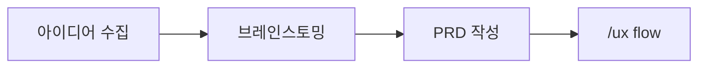

# UX Plan - 기획서 작성

## 목적

아이디어를 체계적으로 정리하고 요구사항 문서(PRD)를 작성합니다.

## 워크플로우



## 실행 절차

### Step 1: 기능명 확인

$ARGUMENTS에서 기능명 파악 또는 질문:

```
어떤 기능을 기획하시나요?
예) 실시간 비용 알림, 대시보드 커스터마이징
```

### Step 2: 브레인스토밍 질문

#### 문제 정의

```
Q1. 어떤 문제를 해결하려고 하나요?
Q2. 현재 이 문제는 어떻게 해결되고 있나요?
Q3. 현재 방식의 한계는 무엇인가요?
```

#### 타겟 사용자

```
Q4. 이 기능을 누가 사용하나요?
Q5. 사용자의 주요 니즈는 무엇인가요?
Q6. 사용자의 숙련도는? (초급/중급/고급)
```

#### 범위 정의

```
Q7. 반드시 포함해야 할 기능은? (Must-have)
Q8. 있으면 좋은 기능은? (Nice-to-have)
Q9. 이번에 포함하지 않을 것은? (Out of scope)
```

### Step 3: PRD 문서 작성

`.claude/templates/prd-template.md`를 기반으로 작성:

#### 문서 위치

```
docs/prd/{기능명}/
├── brainstorm.md        # 브레인스토밍 결과
└── prd.md              # 최종 PRD
```

#### PRD 포함 섹션

1. **배경 및 목적**
   - 문제 정의
   - 해결 방안
   - 목표

2. **타겟 사용자**
   - 페르소나 (`.ux-docs/USER_RESEARCH.md` 참조)
   - 사용자 니즈

3. **사용자 스토리**

```
As a {사용자 유형},
I want to {원하는 기능},
So that {얻고자 하는 가치}.

Acceptance Criteria:
- [ ] {조건 1}
- [ ] {조건 2}
```

4. **기능 요구사항**

| ID | 기능 | 우선순위 | 설명 |
|----|------|---------|------|
| FR-001 | {기능명} | P0 | {설명} |
| FR-002 | {기능명} | P1 | {설명} |

**우선순위 기준**:
- P0: 없으면 안 되는 필수 기능
- P1: 사용성을 크게 높이는 기능
- P2: 있으면 좋은 기능

5. **비기능 요구사항**
   - 성능 (응답 시간, 동시 사용자 수)
   - 접근성 (WCAG 2.1 AA 준수)
   - 보안

6. **성공 지표 (KPIs)**

| 지표 | 현재 | 목표 | 측정 방법 |
|------|------|------|----------|
| 작업 완료 시간 | 5분 | 2분 | 사용자 테스트 |
| 에러 발생률 | 5% | 1% | 로그 분석 |

### Step 4: FUNCTIONAL_REQUIREMENTS.md 업데이트

PRD 내용을 `.ux-docs/FUNCTIONAL_REQUIREMENTS.md`에 추가:

```markdown
## {기능명}

### 요구사항

{PRD의 기능 요구사항 요약}

### 우선순위

- P0: {필수 기능 리스트}
- P1: {중요 기능 리스트}
- P2: {부가 기능 리스트}
```

### Step 5: CURRENT_CONTEXT.md 업데이트

```markdown
## 워크플로우 상태

- **현재 기능**: {기능명}
- **현재 단계**: Plan 완료
- **다음 단계**: Flow 설계
```

### Step 6: 완료 보고

```
============================================
 [UX PLAN] 기획 완료
============================================

 기능: {기능명}

 생성된 문서:
 ✅ docs/prd/{기능명}/brainstorm.md
 ✅ docs/prd/{기능명}/prd.md
 ✅ .ux-docs/FUNCTIONAL_REQUIREMENTS.md (업데이트)

 요약:
 • 타겟 사용자: {n}개 페르소나
 • 사용자 스토리: {n}개
 • 기능 요구사항: {n}개 (P0: {n}, P1: {n}, P2: {n})

 다음 단계:
 1. 사용자 플로우 설계: /ux flow
 2. 매뉴얼 프로젝트 시작: /ux manual init

============================================
```

## 참조 파일

- `.claude/templates/prd-template.md`
- `.ux-docs/USER_RESEARCH.md` - 페르소나 정보
- `.ux-docs/UX_PATTERNS.md` - 기존 UX 패턴
