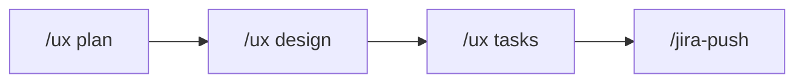
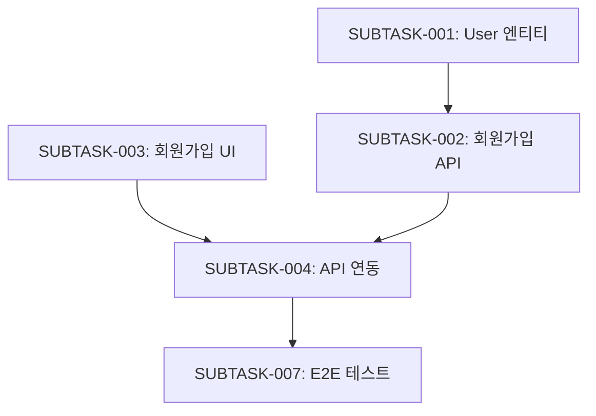

# /ux tasks - 태스크 분해

PRD와 화면 설계를 기반으로 개발 태스크를 분해하고 Worktree를 생성합니다.

## 목적

- 기획 문서를 실행 가능한 개발 태스크로 분해
- Epic → Task → Subtask 계층 구조 생성 (Story 레벨 제외)
- 우선순위 및 의존성 정의
- JIRA 동기화 준비

---

## 워크플로우



---

## 실행 절차

### Step 1: 컨텍스트 수집

다음 파일들을 읽어 태스크 분해 기반 마련:

```bash
# 필수 파일
.ux-docs/FUNCTIONAL_REQUIREMENTS.md  # 기능 요구사항
.ux-docs/USER_FLOWS.md               # 사용자 플로우
docs/design/{기능명}/screens.md      # 화면 설계
docs/prd/{기능명}/prd.md             # PRD

# 선택 파일
.ux-docs/PROJECT_CONTEXT.md          # 프로젝트 컨텍스트
```

---

### Step 2: Epic 정의

기능 단위로 Epic 생성:

```markdown
## Epic 정의

### EPIC-001: {기능명}

**설명**: {기능의 전체적인 목표와 범위}

**목표**:
- {목표 1}
- {목표 2}

**범위**:
- ✅ 포함: {포함 항목}
- ❌ 제외: {제외 항목}

**우선순위**: P0 (필수)

**예상 기간**: 2주
```

---

### Step 3: Task 분해

Epic을 실제 개발 작업 단위인 Task로 분해:

#### Task 작성 규칙

각 Task는 **구체적이고 독립적으로 완료 가능한 작업 단위**:
- 명확한 완료 조건 (Definition of Done)
- 1-3일 내 완료 가능한 크기
- 담당자 1명이 처리 가능한 범위
- 테스트 가능한 단위

#### Task 레벨 예시
- ✅ 좋은 예: "로그인 화면 퍼블리싱", "회원가입 API 구현", "프로필 페이지 UI 개발"
- ❌ 나쁜 예: "프론트엔드 개발", "백엔드 작업", "UI 작업"

#### Task 예시

```markdown
### TASK-001: 사용자 회원가입 기능

**문제점/해결해야 할 이슈**:
신규 사용자가 서비스를 이용하기 위한 회원가입 시스템이 필요합니다.

**요구사항**:
- 이메일, 비밀번호, 이름 입력 폼 제공
- 이메일 형식 검증 (@ 포함)
- 비밀번호 강도 검증 (8자 이상, 영문+숫자)
- 중복 이메일 확인
- 가입 완료 시 확인 이메일 발송
- 에러 메시지 명확하게 표시

**작업 Step**:
1. User 엔티티 설계 및 DB 스키마 생성
2. 회원가입 API 엔드포인트 구현
3. 회원가입 폼 UI 컴포넌트 구현
4. API 연동 및 에러 핸들링
5. 유효성 검사 및 테스트

**결과**: (작업 완료 후 업데이트)

**화면**:
- SC-001: 회원가입 폼
- SC-002: 가입 완료 페이지
- SC-003: 에러 상태

**우선순위**: P0
**예상 기간**: 3일
**Due Date**: 2026-01-02
```

---

### Step 4: Sub-task 분해

Task를 **구현 레벨의 세부 작업**으로 분해:

#### Sub-task 작성 규칙

각 Sub-task는 **구체적인 구현 단위**:
- 2-4시간 내 완료 가능
- 코드 레벨의 구체적 작업
- PR(Pull Request) 단위로 관리 가능

#### Sub-task 레벨 예시

**Task: "로그인 화면 퍼블리싱"의 Sub-tasks:**
- ✅ "로그인 폼 컴포넌트 제작"
- ✅ "이메일/비밀번호 validation 로직 구현"
- ✅ "에러 메시지 UI 컴포넌트 구현"
- ✅ "자동 로그인 체크박스 기능 구현"
- ✅ "비밀번호 표시/숨김 토글 기능"
- ✅ "로그인 버튼 로딩 상태 처리"

**Task: "회원가입 API 구현"의 Sub-tasks:**
- ✅ "User 엔티티 및 DB 스키마 생성"
- ✅ "이메일 중복 체크 API 엔드포인트"
- ✅ "비밀번호 암호화 로직 구현"
- ✅ "회원가입 validation middleware 구현"
- ✅ "인증 이메일 발송 서비스 구현"
- ✅ "회원가입 성공/실패 응답 처리"

#### Subtask 예시

```markdown
### SUBTASK-001: User 엔티티 설계

**타입**: Backend
**상위 Task**: TASK-001

**문제점/해결해야 할 이슈**:
회원가입 기능을 위한 User 데이터 모델이 필요합니다.

**요구사항**:
- User 엔티티 클래스 정의 (id, email, password, name, created_at)
- 이메일 unique 제약조건 추가
- 비밀번호 해싱 로직 구현
- Migration 파일 생성

**작업 Step**:
1. User 엔티티 클래스 생성
2. 필드 정의 및 데코레이터 추가
3. 이메일 unique 인덱스 설정
4. 비밀번호 해싱 메서드 구현
5. Migration 파일 생성 및 테스트

**결과**: (작업 완료 후 업데이트)

**기술 스택**: PostgreSQL, TypeORM

**예상 시간**: 2시간
**우선순위**: P0
**의존성**: 없음

---

### SUBTASK-002: 회원가입 API 구현

**타입**: Backend
**상위 Task**: TASK-001

**문제점/해결해야 할 이슈**:
클라이언트에서 회원가입 요청을 처리할 API가 필요합니다.

**요구사항**:
- POST /api/auth/signup 엔드포인트 구현
- DTO 정의 (SignupDto)
- 입력 검증 (class-validator)
- 중복 이메일 체크
- 비밀번호 해싱
- User 생성 및 저장
- JWT 토큰 발급
- 에러 핸들링 (400, 409, 500)

**작업 Step**:
1. SignupDto 클래스 생성
2. Controller에 signup 엔드포인트 추가
3. Service에 회원가입 로직 구현
4. 중복 이메일 체크 로직
5. JWT 토큰 발급 로직
6. 에러 핸들러 구현
7. 단위 테스트 작성

**결과**: (작업 완료 후 업데이트)

**API 스펙**:
```json
POST /api/auth/signup
{
  "email": "user@example.com",
  "password": "Password123",
  "name": "홍길동"
}

Response 201:
{
  "user": { "id": 1, "email": "...", "name": "..." },
  "token": "eyJ..."
}
```

**예상 시간**: 4시간
**우선순위**: P0
**의존성**: SUBTASK-001 완료 후

---

### SUBTASK-003: 회원가입 폼 UI 구현

**타입**: Frontend
**상위 Task**: TASK-001

**문제점/해결해야 할 이슈**:
사용자가 회원가입 정보를 입력할 수 있는 폼 화면이 필요합니다.

**요구사항**:
- SignupForm 컴포넌트 생성
- Input 필드 (이메일, 비밀번호, 이름)
- 실시간 유효성 검사
- 에러 메시지 표시
- 제출 버튼 (로딩 상태 포함)
- 로그인 페이지 링크

**작업 Step**:
1. SignupForm 컴포넌트 생성
2. 폼 필드 레이아웃 구성
3. 입력 유효성 검사 로직
4. 에러 상태 UI 구현
5. 제출 버튼 및 로딩 상태
6. 스타일링 및 반응형 처리

**결과**: (작업 완료 후 업데이트)

**사용 컴포넌트**:
- Input (디자인 시스템)
- Button (디자인 시스템)
- ErrorMessage (신규)

**예상 시간**: 3시간
**우선순위**: P0
**의존성**: 디자인 시스템 Input/Button 컴포넌트
```

---

### Step 5: Worktree 구조 생성

#### Worktree JSON 구조 (Epic > Task > Sub-task)

**계층별 역할**:
- **Epic**: 프로젝트 또는 큰 기능 (예: "로그인 시스템", "대시보드")
- **Task**: 구체적 작업 단위 (예: "로그인 화면 퍼블리싱", "회원가입 API 구현")
- **Sub-task**: 세부 구현 (예: "로그인 컴포넌트 제작", "validation 로직")

```json
{
  "project": "User Authentication System",
  "created_at": "2025-12-30T15:30:00Z",
  "updated_at": "2025-12-30T15:30:00Z",
  "epics": [
    {
      "id": "EPIC-001",
      "title": "사용자 인증 시스템",
      "description": "회원가입, 로그인, 비밀번호 찾기 기능",
      "problem": "사용자가 서비스를 이용하기 위한 인증 시스템이 필요합니다.",
      "requirements": [
        "안전한 비밀번호 저장",
        "JWT 기반 인증",
        "이메일 중복 방지",
        "비밀번호 찾기 기능"
      ],
      "steps": [
        "User 엔티티 및 인증 구조 설계",
        "회원가입/로그인 API 구현",
        "프론트엔드 폼 구현",
        "테스트 및 보안 검증"
      ],
      "result": "작업 완료 후 업데이트 예정",
      "status": "todo",
      "priority": "P0",
      "estimated_duration": "2주",
      "tasks": [
        {
          "id": "TASK-001",
          "title": "사용자 회원가입 기능",
          "problem": "신규 사용자가 서비스를 이용하기 위한 회원가입 시스템이 필요합니다.",
          "requirements": [
            "이메일, 비밀번호, 이름 입력 폼 제공",
            "이메일 형식 검증",
            "비밀번호 강도 검증",
            "중복 이메일 확인",
            "가입 완료 시 확인 이메일 발송"
          ],
          "steps": [
            "User 엔티티 설계 및 DB 스키마 생성",
            "회원가입 API 엔드포인트 구현",
            "회원가입 폼 UI 컴포넌트 구현",
            "API 연동 및 에러 핸들링",
            "유효성 검사 및 테스트"
          ],
          "result": "작업 완료 후 업데이트 예정",
          "status": "todo",
          "priority": "P0",
          "estimated_duration": "3일",
          "duedate": "2026-01-02",
          "subtasks": [
            {
              "id": "SUBTASK-001",
              "title": "User 엔티티 설계",
              "type": "backend",
              "problem": "회원가입 기능을 위한 User 데이터 모델이 필요합니다.",
              "requirements": [
                "User 엔티티 클래스 정의",
                "이메일 unique 제약조건",
                "비밀번호 해싱 로직",
                "Migration 파일 생성"
              ],
              "steps": [
                "User 엔티티 클래스 생성",
                "필드 정의 및 데코레이터 추가",
                "이메일 unique 인덱스 설정",
                "비밀번호 해싱 메서드 구현",
                "Migration 파일 생성 및 테스트"
              ],
              "result": "작업 완료 후 업데이트 예정",
              "status": "todo",
              "priority": "P0",
              "estimated_hours": 2,
              "dependencies": [],
              "assignee": null,
              "tags": ["database", "entity"]
            },
            {
              "id": "SUBTASK-002",
              "title": "회원가입 API 구현",
              "type": "backend",
              "problem": "클라이언트에서 회원가입 요청을 처리할 API가 필요합니다.",
              "requirements": [
                "POST /api/auth/signup 엔드포인트",
                "입력 검증",
                "중복 이메일 체크",
                "JWT 토큰 발급",
                "에러 핸들링"
              ],
              "steps": [
                "SignupDto 클래스 생성",
                "Controller에 signup 엔드포인트 추가",
                "Service에 회원가입 로직 구현",
                "중복 이메일 체크 로직",
                "JWT 토큰 발급 로직",
                "에러 핸들러 구현",
                "단위 테스트 작성"
              ],
              "result": "작업 완료 후 업데이트 예정",
              "status": "todo",
              "priority": "P0",
              "estimated_hours": 4,
              "dependencies": ["SUBTASK-001"],
              "assignee": null,
              "tags": ["api", "auth"]
            },
            {
              "id": "SUBTASK-003",
              "title": "회원가입 폼 UI 구현",
              "type": "frontend",
              "problem": "사용자가 회원가입 정보를 입력할 수 있는 폼 화면이 필요합니다.",
              "requirements": [
                "SignupForm 컴포넌트",
                "입력 필드 (이메일, 비밀번호, 이름)",
                "실시간 유효성 검사",
                "에러 메시지 표시",
                "제출 버튼 및 로딩 상태"
              ],
              "steps": [
                "SignupForm 컴포넌트 생성",
                "폼 필드 레이아웃 구성",
                "입력 유효성 검사 로직",
                "에러 상태 UI 구현",
                "제출 버튼 및 로딩 상태",
                "스타일링 및 반응형 처리"
              ],
              "result": "작업 완료 후 업데이트 예정",
              "status": "todo",
              "priority": "P0",
              "estimated_hours": 3,
              "dependencies": [],
              "assignee": null,
              "tags": ["ui", "form"]
            }
          ]
        }
      ]
    }
  ],
  "summary": {
    "total_epics": 1,
    "total_tasks": 1,
    "total_subtasks": 3,
    "estimated_total_hours": 9,
    "by_type": {
      "backend": 2,
      "frontend": 1
    },
    "by_priority": {
      "P0": 3,
      "P1": 0,
      "P2": 0
    }
  }
}
```

**저장 위치**: `.claude-state/worktree.json`

---

### Step 6: 태스크 분해 문서 생성

```markdown
# {기능명} - 태스크 분해

생성일: 2025-12-30
상태: 준비 완료

---

## Epic 구조

### EPIC-001: 사용자 인증 시스템

#### TASK-001: 사용자 회원가입 기능 (3일, Due: 2026-01-02)
- SUBTASK-001: User 엔티티 설계 (Backend, 2h)
- SUBTASK-002: 회원가입 API 구현 (Backend, 4h) ← SUBTASK-001
- SUBTASK-003: 회원가입 폼 UI 구현 (Frontend, 3h)
- SUBTASK-004: API 연동 (Frontend, 2h) ← SUBTASK-002, SUBTASK-003
- SUBTASK-005: 유효성 검사 (Frontend, 2h)
- SUBTASK-006: 단위 테스트 (Backend, 3h) ← SUBTASK-002
- SUBTASK-007: E2E 테스트 (QA, 2h) ← SUBTASK-004

#### TASK-002: 사용자 로그인 기능 (2일, Due: 2026-01-02)
...

---

## 우선순위별 태스크

### P0 (필수) - 7개
1. SUBTASK-001: User 엔티티 설계
2. SUBTASK-002: 회원가입 API 구현
3. SUBTASK-003: 회원가입 폼 UI 구현
...

### P1 (중요) - 3개
...

---

## 의존성 그래프



---

## 예상 일정

**총 예상 시간**: 18시간
**인원**: 2명 (FE 1, BE 1)
**예상 기간**: 3일
**Due Date**: 2026-01-02

### Day 1
- SUBTASK-001: User 엔티티 설계
- SUBTASK-003: 회원가입 폼 UI 구현

### Day 2
- SUBTASK-002: 회원가입 API 구현
- SUBTASK-005: 유효성 검사

### Day 3
- SUBTASK-004: API 연동
- SUBTASK-006: 단위 테스트
- SUBTASK-007: E2E 테스트
```

**저장 위치**: `docs/tasks/{기능명}/tasks.md`

---

### Step 7: CURRENT_CONTEXT.md 업데이트

```markdown
## 워크플로우 상태

- **현재 기능**: 사용자 인증 시스템
- **현재 단계**: Tasks 분해 완료
- **다음 단계**: JIRA 동기화

## 태스크 현황

- **Epic**: 1개
- **Task**: 2개
- **Subtask**: 7개 (P0: 5개, P1: 2개)
- **예상 기간**: 3일
```

---

## 완료 보고

```
============================================
 [UX TASKS] 태스크 분해 완료
============================================

 기능: 사용자 인증 시스템

 생성된 구조:
 ✅ Epic: 1개
 ✅ Task: 2개
 ✅ Subtask: 7개

 우선순위별:
 • P0 (필수): 5개
 • P1 (중요): 2개
 • P2 (부가): 0개

 타입별:
 • Backend: 3개
 • Frontend: 3개
 • QA: 1개

 예상 소요:
 • 총 시간: 18시간
 • 예상 기간: 3일

 생성된 파일:
 ✅ .claude-state/worktree.json
 ✅ docs/tasks/{기능명}/tasks.md

 다음 단계:
 1. JIRA 동기화: /jira-push
 2. 태스크 시작: (개발팀과 공유)
 3. 상태 추적: /jira-status

============================================
```

---

## 태스크 분해 원칙

### 1. 계층 구조

- **Epic**: 대규모 기능 단위 (예: 사용자 인증 시스템)
- **Task**: Epic의 하위 기능 단위 (예: 회원가입 기능, 로그인 기능)
- **Subtask**: Task의 실제 구현 작업 (예: User 엔티티 설계, API 구현)

### 2. 적절한 크기

- **Task**: 2-5일 내에 완료 가능한 크기
- **Subtask**: 2-8시간 내에 완료 가능한 크기
- 8시간 초과 시 더 작게 분해
- 2시간 미만은 너무 작음 (병합 고려)

### 3. 명확한 완료 조건

각 Subtask는 **완료 조건**이 명확해야 함:
- ✅ "User 엔티티 클래스 생성 완료"
- ❌ "데이터베이스 작업"

### 4. 4가지 필수 섹션

모든 Task와 Subtask는 다음 섹션을 포함:
- **문제점/해결해야 할 이슈**: 왜 이 작업이 필요한가?
- **요구사항**: 무엇을 만들어야 하는가?
- **작업 Step**: 어떻게 진행할 것인가?
- **결과**: 무엇이 완성되었는가? (작업 완료 후 업데이트)

### 5. 의존성 최소화

- 병렬 작업 가능하도록 의존성 최소화
- 필수 의존성만 명시
- 순환 의존성 금지

### 6. 타입 분류

- **Backend**: 서버, API, DB
- **Frontend**: UI, 클라이언트 로직
- **Design**: 디자인, 프로토타입
- **QA**: 테스트, 검증
- **DevOps**: 배포, 인프라

---

## 자동 활성화 스킬

이 명령어 실행 시 자동으로 활성화되지 않음 (순수 분석 작업)

---

## 참조 파일

- `.ux-docs/FUNCTIONAL_REQUIREMENTS.md` - 기능 요구사항
- `.ux-docs/USER_FLOWS.md` - 사용자 플로우
- `docs/design/{기능명}/screens.md` - 화면 설계
- `docs/prd/{기능명}/prd.md` - PRD
- `.claude-state/worktree.json` - Worktree 저장소
