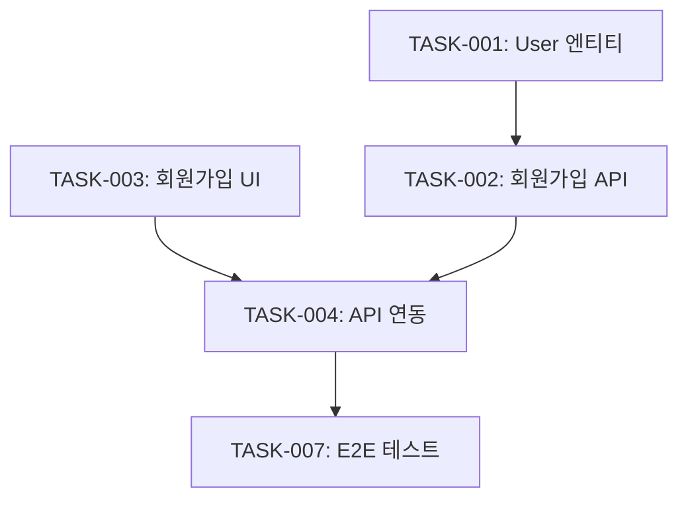

# /ux tasks - 태스크 분해

PRD와 화면 설계를 기반으로 개발 태스크를 분해하고 Worktree를 생성합니다.

## 목적

- 기획 문서를 실행 가능한 개발 태스크로 분해
- Epic → Story → Task 계층 구조 생성
- 우선순위 및 의존성 정의
- JIRA 동기화 준비

---

## 워크플로우


---

## 실행 절차

### Step 1: 컨텍스트 수집

다음 파일들을 읽어 태스크 분해 기반 마련:

```bash
# 필수 파일
.ux-docs/FUNCTIONAL_REQUIREMENTS.md  # 기능 요구사항
.ux-docs/USER_FLOWS.md               # 사용자 플로우
docs/design/{기능명}/screens.md      # 화면 설계
docs/prd/{기능명}/prd.md             # PRD

# 선택 파일
.ux-docs/PROJECT_CONTEXT.md          # 프로젝트 컨텍스트
```

---

### Step 2: Epic 정의

기능 단위로 Epic 생성:

```markdown
## Epic 정의

### EPIC-001: {기능명}

**설명**: {기능의 전체적인 목표와 범위}

**목표**:
- {목표 1}
- {목표 2}

**범위**:
- ✅ 포함: {포함 항목}
- ❌ 제외: {제외 항목}

**우선순위**: P0 (필수)

**예상 기간**: 2주
```

---

### Step 3: Story 분해

Epic을 사용자 중심의 Story로 분해:

#### Story 작성 규칙

```
As a {사용자 타입},
I want to {원하는 기능},
So that {얻고자 하는 가치}.
```

#### Story 예시

```markdown
### STORY-001: 사용자 회원가입

**User Story**:
As a 신규 사용자,
I want to 이메일로 회원가입하고,
So that 서비스를 이용할 수 있다.

**Acceptance Criteria** (완료 조건):
- [ ] 이메일, 비밀번호, 이름 입력 폼 표시
- [ ] 이메일 형식 검증 (@ 포함)
- [ ] 비밀번호 강도 검증 (8자 이상, 영문+숫자)
- [ ] 중복 이메일 확인
- [ ] 가입 완료 시 확인 이메일 발송
- [ ] 에러 메시지 명확하게 표시

**화면**:
- SC-001: 회원가입 폼
- SC-002: 가입 완료 페이지
- SC-003: 에러 상태

**우선순위**: P0

**예상 기간**: 3일
```

---

### Step 4: Task 분해

Story를 실제 개발 작업으로 분해:

#### Task 분류

1. **Frontend Tasks**
   - UI 컴포넌트
   - 페이지/라우팅
   - 상태 관리
   - API 연동

2. **Backend Tasks**
   - API 엔드포인트
   - 데이터베이스
   - 비즈니스 로직
   - 검증/보안

3. **Design Tasks**
   - 화면 디자인
   - 컴포넌트 디자인
   - 프로토타입

4. **QA Tasks**
   - 테스트 케이스 작성
   - 테스트 실행
   - 버그 수정

#### Task 예시

```markdown
### TASK-001: User 엔티티 설계

**타입**: Backend
**Story**: STORY-001

**설명**:
데이터베이스에 User 테이블 생성

**상세 작업**:
- [ ] User 엔티티 클래스 정의 (id, email, password, name, created_at)
- [ ] 이메일 unique 제약조건 추가
- [ ] 비밀번호 해싱 로직 구현
- [ ] Migration 파일 생성

**기술 스택**: PostgreSQL, TypeORM

**예상 시간**: 2시간

**우선순위**: P0

**의존성**: 없음

---

### TASK-002: 회원가입 API 구현

**타입**: Backend
**Story**: STORY-001

**설명**:
POST /api/auth/signup 엔드포인트 구현

**상세 작업**:
- [ ] DTO 정의 (SignupDto)
- [ ] 입력 검증 (class-validator)
- [ ] 중복 이메일 체크
- [ ] 비밀번호 해싱
- [ ] User 생성 및 저장
- [ ] JWT 토큰 발급
- [ ] 에러 핸들링 (400, 409, 500)

**API 스펙**:
```json
POST /api/auth/signup
{
  "email": "user@example.com",
  "password": "Password123",
  "name": "홍길동"
}

Response 201:
{
  "user": { "id": 1, "email": "...", "name": "..." },
  "token": "eyJ..."
}
```

**예상 시간**: 4시간

**우선순위**: P0

**의존성**: TASK-001 완료 후

---

### TASK-003: 회원가입 폼 UI 구현

**타입**: Frontend
**Story**: STORY-001

**설명**:
회원가입 화면 UI 컴포넌트 구현

**상세 작업**:
- [ ] SignupForm 컴포넌트 생성
- [ ] Input 필드 (이메일, 비밀번호, 이름)
- [ ] 실시간 유효성 검사
- [ ] 에러 메시지 표시
- [ ] 제출 버튼 (로딩 상태 포함)
- [ ] 로그인 페이지 링크

**사용 컴포넌트**:
- Input (디자인 시스템)
- Button (디자인 시스템)
- ErrorMessage (신규)

**예상 시간**: 3시간

**우선순위**: P0

**의존성**: 디자인 시스템 Input/Button 컴포넌트
```

---

### Step 5: Worktree 구조 생성

#### Worktree JSON 구조

```json
{
  "project": "User Authentication System",
  "created_at": "2025-12-30T15:30:00Z",
  "updated_at": "2025-12-30T15:30:00Z",
  "epics": [
    {
      "id": "EPIC-001",
      "title": "사용자 인증 시스템",
      "description": "회원가입, 로그인, 비밀번호 찾기 기능",
      "status": "todo",
      "priority": "P0",
      "estimated_duration": "2주",
      "stories": [
        {
          "id": "STORY-001",
          "title": "사용자 회원가입",
          "user_story": "As a 신규 사용자, I want to 이메일로 회원가입하고, So that 서비스를 이용할 수 있다.",
          "acceptance_criteria": [
            "이메일, 비밀번호, 이름 입력 폼 표시",
            "이메일 형식 검증",
            "비밀번호 강도 검증",
            "중복 이메일 확인",
            "가입 완료 시 확인 이메일 발송"
          ],
          "status": "todo",
          "priority": "P0",
          "estimated_duration": "3일",
          "tasks": [
            {
              "id": "TASK-001",
              "title": "User 엔티티 설계",
              "type": "backend",
              "description": "데이터베이스에 User 테이블 생성",
              "status": "todo",
              "priority": "P0",
              "estimated_hours": 2,
              "dependencies": [],
              "assignee": null,
              "tags": ["database", "entity"]
            },
            {
              "id": "TASK-002",
              "title": "회원가입 API 구현",
              "type": "backend",
              "description": "POST /api/auth/signup 엔드포인트 구현",
              "status": "todo",
              "priority": "P0",
              "estimated_hours": 4,
              "dependencies": ["TASK-001"],
              "assignee": null,
              "tags": ["api", "auth"]
            },
            {
              "id": "TASK-003",
              "title": "회원가입 폼 UI 구현",
              "type": "frontend",
              "description": "회원가입 화면 UI 컴포넌트 구현",
              "status": "todo",
              "priority": "P0",
              "estimated_hours": 3,
              "dependencies": [],
              "assignee": null,
              "tags": ["ui", "form"]
            }
          ]
        }
      ]
    }
  ],
  "summary": {
    "total_epics": 1,
    "total_stories": 1,
    "total_tasks": 3,
    "estimated_total_hours": 9,
    "by_type": {
      "backend": 2,
      "frontend": 1
    },
    "by_priority": {
      "P0": 3,
      "P1": 0,
      "P2": 0
    }
  }
}
```

**저장 위치**: `.claude-state/worktree.json`

---

### Step 6: 태스크 분해 문서 생성

```markdown
# {기능명} - 태스크 분해

생성일: 2025-12-30
상태: 준비 완료

---

## Epic 구조

### EPIC-001: 사용자 인증 시스템

#### STORY-001: 사용자 회원가입
- TASK-001: User 엔티티 설계 (Backend, 2h)
- TASK-002: 회원가입 API 구현 (Backend, 4h) ← TASK-001
- TASK-003: 회원가입 폼 UI 구현 (Frontend, 3h)
- TASK-004: API 연동 (Frontend, 2h) ← TASK-002, TASK-003
- TASK-005: 유효성 검사 (Frontend, 2h)
- TASK-006: 단위 테스트 (Backend, 3h) ← TASK-002
- TASK-007: E2E 테스트 (QA, 2h) ← TASK-004

#### STORY-002: 사용자 로그인
...

---

## 우선순위별 태스크

### P0 (필수) - 7개
1. TASK-001: User 엔티티 설계
2. TASK-002: 회원가입 API 구현
3. TASK-003: 회원가입 폼 UI 구현
...

### P1 (중요) - 3개
...

---

## 의존성 그래프



---

## 예상 일정

**총 예상 시간**: 18시간
**인원**: 2명 (FE 1, BE 1)
**예상 기간**: 3일

### Day 1
- TASK-001: User 엔티티 설계
- TASK-003: 회원가입 폼 UI 구현

### Day 2
- TASK-002: 회원가입 API 구현
- TASK-005: 유효성 검사

### Day 3
- TASK-004: API 연동
- TASK-006: 단위 테스트
- TASK-007: E2E 테스트
```

**저장 위치**: `docs/tasks/{기능명}/tasks.md`

---

### Step 7: CURRENT_CONTEXT.md 업데이트

```markdown
## 워크플로우 상태

- **현재 기능**: 사용자 인증 시스템
- **현재 단계**: Tasks 분해 완료
- **다음 단계**: JIRA 동기화

## 태스크 현황

- **Epic**: 1개
- **Story**: 2개
- **Task**: 7개 (P0: 5개, P1: 2개)
- **예상 기간**: 3일
```

---

## 완료 보고

```
============================================
 [UX TASKS] 태스크 분해 완료
============================================

 기능: 사용자 인증 시스템

 생성된 구조:
 ✅ Epic: 1개
 ✅ Story: 2개
 ✅ Task: 7개

 우선순위별:
 • P0 (필수): 5개
 • P1 (중요): 2개
 • P2 (부가): 0개

 타입별:
 • Backend: 3개
 • Frontend: 3개
 • QA: 1개

 예상 소요:
 • 총 시간: 18시간
 • 예상 기간: 3일

 생성된 파일:
 ✅ .claude-state/worktree.json
 ✅ docs/tasks/{기능명}/tasks.md

 다음 단계:
 1. JIRA 동기화: /jira-push
 2. 태스크 시작: (개발팀과 공유)
 3. 상태 추적: /jira-status

============================================
```

---

## 태스크 분해 원칙

### 1. 적절한 크기

- Task는 **2-8시간** 내에 완료 가능한 크기
- 8시간 초과 시 더 작게 분해
- 2시간 미만은 너무 작음 (병합 고려)

### 2. 명확한 완료 조건

각 Task는 **완료 조건**이 명확해야 함:
- ✅ "User 엔티티 클래스 생성 완료"
- ❌ "데이터베이스 작업"

### 3. 의존성 최소화

- 병렬 작업 가능하도록 의존성 최소화
- 필수 의존성만 명시
- 순환 의존성 금지

### 4. 타입 분류

- **Backend**: 서버, API, DB
- **Frontend**: UI, 클라이언트 로직
- **Design**: 디자인, 프로토타입
- **QA**: 테스트, 검증
- **DevOps**: 배포, 인프라

---

## 자동 활성화 스킬

이 명령어 실행 시 자동으로 활성화되지 않음 (순수 분석 작업)

---

## 참조 파일

- `.ux-docs/FUNCTIONAL_REQUIREMENTS.md` - 기능 요구사항
- `.ux-docs/USER_FLOWS.md` - 사용자 플로우
- `docs/design/{기능명}/screens.md` - 화면 설계
- `docs/prd/{기능명}/prd.md` - PRD
- `.claude-state/worktree.json` - Worktree 저장소
