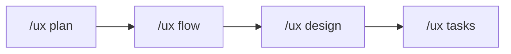
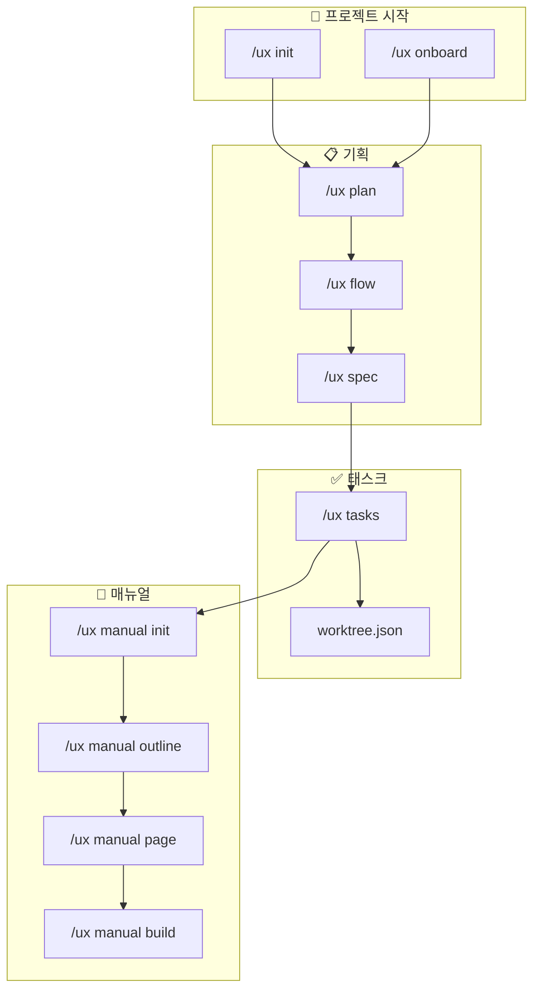

# 원더 무브 연구소 Claude Code UX Plugin

> **어떤 상황에서든 동일한 UX 설계 품질을 보장하는** AI 기획 도구

---

## CRITICAL RULES (절대 무시 금지)

이 섹션의 규칙들은 **모든 응답에서 반드시 준수**해야 합니다.
컨텍스트가 compact되더라도 이 규칙들을 잊지 마세요.

### 핵심 규칙 요약

1. **컨텍스트 유지**: 작업 시작 전 `.ux-docs/CURRENT_CONTEXT.md` 확인 필수
2. **UX 규칙 준수**: 기획 작성 전 `.ux-docs/UX_PATTERNS.md` 참조 필수
3. **진행 상황 저장**: 중요 진행점마다 `/ux save-progress` 실행 권장
4. **작업 스택 유지**: 하위 작업 진입 시 상위 작업 목표 기억
5. **Worktree 추적**: 태스크 진행 시 worktree 상태 자동 업데이트

---

## 빠른 시작

```bash
# 상황 1: 새 프로젝트 시작
/ux init [프로젝트명]

# 상황 2: 기존 프로젝트 투입
/ux onboard

# 상황 3: 작업 재개 (세션 시작, Compact 후)
/ux restore-context
```

---

## 주요 명령어

### 프로젝트 설정

| 명령어 | 설명 |
|--------|------|
| `/ux init [프로젝트명]` | 신규 프로젝트 기본 세트 생성 |
| `/ux onboard` | 기존 프로젝트 분석 및 문서 세트 생성 |
| `/ux project-code [코드]` | 프로젝트 코드 설정/조회 (JIRA 티켓용) |
| `/ux figma-sync [URL]` | Figma 디자인 토큰/컴포넌트 동기화 |

### 기획 워크플로우



| 명령어 | 설명 |
|--------|------|
| `/ux plan [기능명]` | PRD/기획서 초안 생성 |
| `/ux flow [기능명]` | 사용자 플로우 다이어그램 생성 |
| `/ux design [기능명]` | 화면 시안 및 레이아웃 제안 (엣지 케이스 포함) |
| `/ux tasks` | 기획서 기반 태스크 분해 |
| `/ux handoff` | 개발팀 전달용 스펙 문서 생성 |

### 매뉴얼 제작

| 명령어 | 설명 |
|--------|------|
| `/ux manual init [제품명]` | 매뉴얼 프로젝트 초기화 |
| `/ux manual outline` | 매뉴얼 목차 자동 생성 |
| `/ux manual page [섹션]` | 개별 페이지 초안 작성 |
| `/ux manual build` | PPT 파일 빌드 준비 |

### JIRA 연동

| 명령어 | 설명 |
|--------|------|
| `/jira-push` | JIRA에 이슈 자동 생성 ([프로젝트코드] prefix + 태그 자동 추가) |
| `/jira-sync` | 양방향 동기화 |
| `/jira-status` | 연동 상태 확인 |

**참고**: JIRA 티켓 생성 전 `/ux project-code` 로 프로젝트 코드를 먼저 설정하세요.

### 컨텍스트 관리

| 명령어 | 설명 |
|--------|------|
| `/ux restore-context` | 중단된 작업 컨텍스트 복원 |
| `/ux status` | 현재 프로젝트 상태 확인 |

---

## 자동 활성화 스킬

다음 스킬들이 키워드 감지 시 자동으로 활성화됩니다:

| 스킬 | 활성화 키워드 | 동작 |
|------|--------------|------|
| `ux-writing` | 기획서 작성, 문구, 버튼명, 메시지 | UX 라이팅 가이드라인 자동 적용 |
| `accessibility` | 접근성, WCAG, 스크린리더, 키보드 | 접근성 체크리스트 참조 |
| `design-system` | 컴포넌트, 버튼, 색상, 타이포 | 디자인 시스템 규칙 자동 참조 |
| `handoff-spec` | 핸드오프, 개발 전달, 스펙 | 개발팀 전달 포맷 적용 |
| `manual-template` | 매뉴얼, 사용자 가이드, PPT | 매뉴얼 템플릿 자동 적용 |

---

## 플러그인 통합 플로우



---

## Compact 발생 시 대응

컨텍스트가 압축되면 다음을 수행하세요:

1. `/ux restore-context` 실행
2. 복원된 규칙과 작업 상태 확인
3. 필요시 `/ux status`로 진행 상황 확인
4. 작업 재개

---

## 문서 구조

```
project/
├── CLAUDE.md                    # 이 파일 (항상 로드됨)
├── README.md                    # 상세 문서
│
├── .claude/
│   ├── commands/                # 슬래시 커맨드
│   ├── skills/                  # 자동 활성화 스킬
│   ├── templates/               # 문서 템플릿
│   ├── best-practices/          # UX 베스트 프랙티스
│   ├── integrations/            # Figma, JIRA 연동
│   └── hooks/                   # 이벤트 훅
│
├── .ux-docs/                    # UX 문서 저장소
│   ├── PROJECT_CONTEXT.md
│   ├── USER_RESEARCH.md
│   ├── INFORMATION_ARCHITECTURE.md
│   ├── USER_FLOWS.md
│   ├── FUNCTIONAL_REQUIREMENTS.md
│   ├── UX_PATTERNS.md
│   ├── DESIGN_TOKENS.md
│   ├── SPEC_CONVENTIONS.md
│   ├── CURRENT_CONTEXT.md       # 현재 작업 상태
│   └── manuals/                 # 매뉴얼 프로젝트들
│       └── [제품명]/
│
├── .claude-state/               # 런타임 상태
│   ├── worktree.json            # 작업 트리 상태
│   └── jira_mapping.json        # JIRA ID 매핑
│
└── docs/                        # 생성된 기획 문서
```

---

## 상세 문서

전체 명령어 레퍼런스, 사용 예시, 트러블슈팅은 `README.md` 참조
