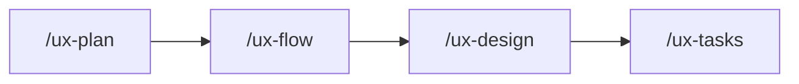

# 원더 무브 연구소 Claude Code UX Plugin

> **어떤 상황에서든 동일한 UX 설계 품질을 보장하는** AI 기획 도구

---

## 🚀 빠른 시작

### 원라인 설치 (GitHub)

```bash
curl -sSL https://raw.githubusercontent.com/wondermove-cd/cd-claude-plugin/main/quick-install.sh | bash
```

### 로컬 설치

```bash
# 프로젝트 디렉토리에서
~/Documents/Claude/cd-claude-plugin/install.sh .
```

---

## 📋 개요

이 플러그인은 기획/디자인 팀을 위한 Claude Code 업무 자동화 도구입니다.

### 핵심 가치

**"프로젝트 시작부터 완료까지, 언제 투입되든 동일한 품질"**

- 새 프로젝트든, 기존 프로젝트든 일관된 기획 품질
- 매뉴얼 제작 자동화로 반복 작업 최소화
- JIRA 연동으로 투명한 진행 상황 공유
- **shadcn/ui 기반 UI 컴포넌트 자동 제안** ⭐ NEW

---

## ✨ 주요 기능

### 1. 프로젝트 온보딩

| 커맨드 | 설명 |
|--------|------|
| `/ux-init [프로젝트명]` | 신규 프로젝트 초기화 및 8개 문서 생성 |
| `/ux-onboard` | 기존 프로젝트 분석 및 컨텍스트 학습 |
| `/ux-project-code [코드]` | 프로젝트 코드 설정/조회 (JIRA 티켓용) |

### 2. 컨텍스트 관리 ⭐

| 커맨드 | 설명 |
|--------|------|
| `/context-save` | 현재 세션 컨텍스트 저장 |
| `/context-restore` | 이전 세션 컨텍스트 복원 |
| `/plugin-update` | GitHub에서 최신 플러그인 업데이트 |

### 3. 기획 워크플로우



| 커맨드 | 설명 |
|--------|------|
| `/ux-plan [기능명]` | PRD/기획서 초안 생성 |
| `/ux-design [기능명]` | 화면 시안 및 레이아웃 제안 (shadcn/ui 기반) |
| `/ux-tasks` | 기획서 기반 태스크 분해 |

### 4. 매뉴얼 제작

| 커맨드 | 설명 |
|--------|------|
| `/ux-manual-init [제품명]` | 매뉴얼 프로젝트 초기화 |
| `/ux-manual-outline` | 매뉴얼 목차 자동 생성 |
| `/ux-manual-page [섹션]` | 개별 페이지 초안 작성 |
| `/ux-manual-build` | PPT 파일 빌드 준비 |

### 5. JIRA 연동

| 커맨드 | 설명 |
|--------|------|
| `/jira-init [프로젝트키]` | JIRA 연동 초기화 |
| `/jira-push` | Worktree → JIRA 동기화 |
| `/jira-status` | 연동 상태 확인 |
| `/jira-figma-sync [티켓키]` | Figma 디자인 동기화 |

**환경변수 필수**:
```bash
export JIRA_HOST='your-company.atlassian.net'
export JIRA_EMAIL='your-email@company.com'
export JIRA_API_TOKEN='your-api-token'
```

---

## 📦 설치 방법

### 방법 1: 자동 설치 (권장)

```bash
# 프로젝트 디렉토리로 이동
cd /path/to/your-project

# 원라인 설치
curl -sSL https://raw.githubusercontent.com/wondermove-cd/cd-claude-plugin/main/quick-install.sh | bash
```

### 방법 2: 로컬 설치

```bash
# 프로젝트 디렉토리로 이동
cd /path/to/your-project

# 로컬 플러그인 설치
~/Documents/Claude/cd-claude-plugin/install.sh .
```

### 설치 확인

```bash
# Claude Code 실행 후
/ux-init "테스트"
```

정상적으로 실행되면 설치 완료!

---

## ⚙️ 환경 설정

### 1. 프로젝트 코드 설정 (필수)

```bash
/ux-project-code SKUBER
```

프로젝트 코드는 JIRA 티켓 생성 시 사용됩니다:
- 티켓 제목: `[SKUBER] 기능명`
- 태그: `SKUBER`

### 2. JIRA 연동 (선택)

`.bashrc` 또는 `.zshrc`에 추가:

```bash
export JIRA_HOST='your-company.atlassian.net'
export JIRA_EMAIL='your-email@company.com'
export JIRA_API_TOKEN='your-api-token'
```

**API 토큰 생성**: https://id.atlassian.com/manage-profile/security/api-tokens

---

## 🎨 UI 설계 특징

### shadcn/ui 기본 지원

React/Next.js 프로젝트에서 기존 디자인 시스템이 없는 경우,
자동으로 **shadcn/ui 컴포넌트**를 기반으로 UI를 제안합니다.

**지원 컴포넌트**:
- Button, Input, Card, Table
- Dialog, Sheet, Popover
- Form (React Hook Form + Zod)
- Toast, Alert, Badge
- 그 외 40+ 컴포넌트

**설치 방법**:
```bash
npx shadcn-ui@latest init
npx shadcn-ui@latest add button card form
```

---

## 🌟 자동 활성화 스킬

키워드 감지 시 자동으로 활성화되는 스킬들:

| 스킬 | 활성화 키워드 | 동작 |
|------|--------------|------|
| `shadcn-ui` | UI 설계, React 프로젝트 | shadcn/ui 컴포넌트 사용 |
| `ux-writing` | 기획서 작성, 문구, 버튼명 | UX 라이팅 가이드라인 적용 |
| `accessibility` | 접근성, WCAG, 스크린리더 | 접근성 체크리스트 참조 |
| `design-system` | 컴포넌트, 버튼, 색상 | 디자인 시스템 규칙 참조 |
| `manual-template` | 매뉴얼, 사용자 가이드 | 매뉴얼 템플릿 적용 |

---

## 📁 프로젝트 구조

```
your-project/
├── CLAUDE.md                    # 플러그인 설정 (항상 로드)
├── .claude/
│   ├── commands/                # 슬래시 커맨드
│   ├── skills/                  # 자동 활성화 스킬
│   └── templates/               # 문서 템플릿
│
├── .ux-docs/                    # UX 문서 저장소
│   ├── PROJECT_CONTEXT.md
│   ├── FUNCTIONAL_REQUIREMENTS.md
│   ├── USER_FLOWS.md
│   ├── UX_PATTERNS.md
│   └── CURRENT_CONTEXT.md       # 현재 작업 상태
│
├── .claude-state/               # 런타임 상태
│   ├── worktree.json            # 작업 트리
│   └── jira_mapping.json        # JIRA ID 매핑
│
└── docs/                        # 생성된 기획 문서
```

---

## 🔄 업데이트

### 최신 버전으로 업데이트

```bash
# Claude Code에서 직접 업데이트
/plugin-update

# 또는 수동 업데이트
cd /path/to/your-project
curl -sSL https://raw.githubusercontent.com/wondermove-cd/cd-claude-plugin/main/quick-install.sh | bash
```

---

## 🛠️ 트러블슈팅

### 명령어가 작동하지 않는 경우

```bash
# .claude 폴더 확인
ls -la .claude/commands

# 재설치
rm -rf .claude CLAUDE.md
curl -sSL https://raw.githubusercontent.com/wondermove-cd/cd-claude-plugin/main/quick-install.sh | bash
```

### 컨텍스트가 압축된 경우

```bash
# 컨텍스트 복원
/context-restore

# 상태 확인
/ux-status
```

---

## 📞 지원

- **GitHub Issues**: https://github.com/wondermove-cd/cd-claude-plugin/issues
- **문서**: https://github.com/wondermove-cd/cd-claude-plugin
- **이메일**: support@wondermove.com

---

## 📝 라이선스

© 원더무브 연구소. All rights reserved.