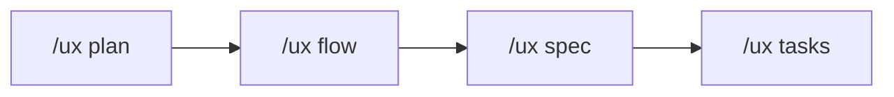
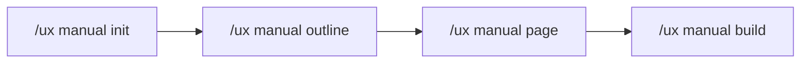

# 원더 무브 연구소 Claude Code UX Plugin

> **어떤 상황에서든 동일한 UX 설계 품질을 보장하는** AI 기획 도구

---

## 📋 개요

이 플러그인은 기획/디자인 팀을 위한 Claude Code 업무 자동화 도구입니다.

### 핵심 가치

**"프로젝트 시작부터 완료까지, 언제 투입되든 동일한 품질"**

- 새 프로젝트든, 기존 프로젝트든 일관된 기획 품질
- 매뉴얼 제작 자동화로 반복 작업 최소화
- JIRA 연동으로 투명한 진행 상황 공유

---

## ✨ 주요 기능

### 1. 프로젝트 온보딩

| 커맨드 | 설명 |
|--------|------|
| `/ux init` | 신규 프로젝트 초기화 및 8개 문서 생성 |
| `/ux onboard` | 기존 프로젝트 분석 및 컨텍스트 학습 |
| `/ux project-code` | 프로젝트 코드 설정/조회 (JIRA 티켓용) |
| `/ux figma-sync` | Figma 디자인 토큰/컴포넌트 동기화 |

### 2. 기획 워크플로우



| 커맨드 | 설명 |
|--------|------|
| `/ux plan` | PRD/기획서 자동 생성 |
| `/ux flow` | 사용자 플로우 다이어그램 생성 |
| `/ux spec` | 상세 화면 기획서 작성 |
| `/ux tasks` | 태스크 분해 및 Worktree 생성 |
| `/ux handoff` | 개발팀 전달용 스펙 문서 생성 |

### 3. 매뉴얼 제작 (핵심 기능 ⭐)



| 커맨드 | 설명 |
|--------|------|
| `/ux manual init` | 매뉴얼 프로젝트 초기화 |
| `/ux manual outline` | 기능 요건 기반 목차 자동 생성 |
| `/ux manual page` | 개별 페이지 초안 작성 (템플릿 기반) |
| `/ux manual build` | PPT 생성 준비 (통합 마크다운 + 가이드) |

### 4. 자동 활성화 스킬

| 스킬 | 활성화 시점 | 역할 |
|------|------------|------|
| `ux-writing` | 기획서 작성, 문구 정의 시 | UX 라이팅 가이드라인 자동 적용 |
| `accessibility` | UI 설계, 색상 지정 시 | WCAG 접근성 기준 자동 체크 |
| `design-system` | 컴포넌트 관련 작업 시 | 디자인 시스템 규칙 자동 참조 |
| `handoff-spec` | 핸드오프 문서 작성 시 | 개발 전달 포맷 자동 적용 |
| `manual-template` | 매뉴얼 작성 시 | 매뉴얼 템플릿 자동 적용 |

---

## 🚀 빠른 시작

### 1단계: 설치

**원클릭 설치 (권장)**:

```bash
# 프로젝트 폴더로 이동
cd /path/to/your-project

# 설치 스크립트 실행
curl -fsSL https://raw.githubusercontent.com/wondermove-cd/cd-claude-plugin/main/install.sh | bash
```

**수동 설치**:

```bash
# 레포지토리 클론
git clone https://github.com/wondermove-cd/cd-claude-plugin.git

# 프로젝트로 복사
cd /path/to/your-project
cp -r cd-claude-plugin/.claude .
cp cd-claude-plugin/CLAUDE.md .
```

### 2단계: 프로젝트 초기화

**새 프로젝트:**
```bash
/ux init "프로젝트명"
```

**기존 프로젝트:**
```bash
/ux onboard
```

### 3단계: Figma 연동 (선택)

```bash
/ux figma-sync [Figma 파일 URL]
```

### 4단계: 기획 시작

```bash
/ux plan "기능명"
```

---

## 📖 사용 시나리오

### 시나리오 1: 신규 기능 기획

```bash
# 1. 기획
/ux plan "실시간 알림 기능"

# 2. 플로우 설계
/ux flow

# 3. 화면 기획서 작성
/ux spec

# 4. 태스크 분해
/ux tasks

# 5. JIRA 동기화
/jira-push
```

### 시나리오 2: 사용자 매뉴얼 제작

```bash
# 1. 매뉴얼 프로젝트 생성
/ux manual init "SKuber v2.0"

# 2. 목차 자동 생성
/ux manual outline

# 3. 개별 페이지 작성
/ux manual page "클러스터 관리"
/ux manual page "모니터링"

# 4. 스크린샷 촬영 및 저장
# assets/screenshots/ 폴더에 저장

# 5. PPT 빌드 준비
/ux manual build
```

---

## 📂 프로젝트 구조

```
project/
├── CLAUDE.md                    # Claude Code 메인 설정
├── README.md                    # 이 문서
│
├── .claude/
│   ├── commands/                # 슬래시 커맨드 (10+개)
│   │   ├── ux-init.md
│   │   ├── ux-onboard.md
│   │   ├── ux-plan.md
│   │   ├── ux-manual-init.md
│   │   └── ...
│   │
│   ├── skills/                  # 자동 활성화 스킬 (5개)
│   │   ├── ux-writing/
│   │   ├── accessibility/
│   │   ├── design-system/
│   │   ├── handoff-spec/
│   │   └── manual-template/
│   │
│   ├── templates/               # 문서 템플릿
│   │   ├── prd-template.md
│   │   └── manual-page-template.md
│   │
│   └── best-practices/          # UX 베스트 프랙티스
│
├── .ux-docs/                    # UX 문서 저장소 (자동 생성)
│   ├── PROJECT_CONTEXT.md
│   ├── USER_RESEARCH.md
│   ├── INFORMATION_ARCHITECTURE.md
│   ├── USER_FLOWS.md
│   ├── FUNCTIONAL_REQUIREMENTS.md
│   ├── UX_PATTERNS.md
│   ├── DESIGN_TOKENS.md
│   ├── SPEC_CONVENTIONS.md
│   ├── CURRENT_CONTEXT.md
│   └── manuals/                 # 매뉴얼 프로젝트들
│       └── [제품명]/
│           ├── MANUAL_OUTLINE.md
│           ├── MANUAL_STYLE_GUIDE.md
│           ├── sections/
│           ├── assets/screenshots/
│           └── output/
│
├── .claude-state/               # 런타임 상태
│   ├── worktree.json            # 작업 트리
│   └── jira_mapping.json        # JIRA ID 매핑
│
└── docs/                        # 생성된 기획 문서
    ├── prd/
    └── handoff/
```

---

## 🎯 매뉴얼 제작 상세 가이드

### 1. 매뉴얼 작성 절차

#### Step 1: 프로젝트 초기화

```bash
/ux manual init "제품명 v1.0"
```

생성되는 구조:
- `MANUAL_OUTLINE.md` - 목차 구조
- `MANUAL_STYLE_GUIDE.md` - 작성 규칙
- `sections/` - 섹션별 마크다운 파일
- `assets/screenshots/` - 스크린샷 저장 위치

#### Step 2: 목차 생성

```bash
/ux manual outline
```

`FUNCTIONAL_REQUIREMENTS.md`를 분석하여:
- 기능별 섹션 자동 구성
- 예상 페이지 수 계산
- 필요한 스크린샷 목록 생성

#### Step 3: 페이지 작성

```bash
/ux manual page "서비스 개요"
/ux manual page "클러스터 관리"
```

각 페이지는 템플릿 기반으로:
- **기능 소개 페이지**: 좌측 설명 + 우측 스크린샷
- **단계별 가이드**: Step 1, 2, 3 순차 구성
- **표/비교 페이지**: 기능 비교표

#### Step 4: 스크린샷 준비

파일명 규칙:
```
{섹션번호}_{기능명}_{유형}_{순서}.png

예시:
03_02_monitoring_main.png
03_02_monitoring_step1.png
03_02_monitoring_step2.png
```

저장 위치: `.ux-docs/manuals/[제품명]/assets/screenshots/`

#### Step 5: PPT 빌드

```bash
/ux manual build
```

생성물:
- `output/{제품명}_Manual_Full.md` - 통합 마크다운
- `output/PPT_GENERATION_GUIDE.md` - PPT 생성 가이드
- `output/BUILD_REPORT.md` - 빌드 리포트

### 2. PPT 생성 방법

#### 옵션 A: 자동 변환 (권장)

```bash
# Marp 사용
npm install -g @marp-team/marp-cli
marp output/{제품명}_Manual_Full.md -o output/{제품명}_Manual.pptx
```

#### 옵션 B: 수동 작업

1. PowerPoint 템플릿 열기
2. 통합 마크다운 참조하여 슬라이드 작성
3. 스크린샷 수동 삽입

---

## 📊 JIRA 연동

### 설정

```bash
# 1. 환경변수 설정
export JIRA_EMAIL='your-email@company.com'
export JIRA_API_TOKEN='your-api-token'

# 2. 프로젝트 코드 설정 (필수!)
/ux project-code SKUBER

# 3. JIRA 연동 초기화
/jira-init YOUR_PROJECT_KEY
```

### 사용

```bash
# Worktree → JIRA 동기화
/jira-push

# JIRA 티켓 생성 예시:
# - 제목: [SKUBER] 클러스터 모니터링 기능
# - 태그: SKUBER

# 양방향 동기화
/jira-sync

# 상태 확인
/jira-status
```

### 프로젝트 코드 활용

**다중 프로젝트 관리**:
```bash
# 프로젝트 A
cd /project-a
/ux project-code PROJA
/jira-push

# 프로젝트 B
cd /project-b
/ux project-code PROJB
/jira-push
```

**JIRA 필터링**:
- JIRA에서 `labels = PROJA` 필터로 프로젝트별 티켓 조회
- 다중 프로젝트: `labels in (PROJA, PROJB)`

---

## 🛠️ 트러블슈팅

| 문제 | 해결 |
|------|------|
| 명령어가 동작하지 않음 | `.claude` 폴더 복사 확인 |
| 온보딩 실패 | `FUNCTIONAL_REQUIREMENTS.md` 또는 기존 문서 확인 |
| 스크린샷 누락 | `BUILD_REPORT.md`에서 누락된 파일 확인 |
| JIRA 연결 실패 | API 토큰 및 프로젝트 키 확인 |

---

## 📈 기대 효과

| 지표 | 개선율 |
|------|--------|
| 온보딩 시간 | 50% 단축 |
| 기획 리뷰 지적사항 | 70% 감소 |
| 컨텍스트 재설명 시간 | 90% 절감 |
| 매뉴얼 제작 시간 | 60% 단축 |

---

## 📝 라이선스

© 원더무브 연구소

---

## 🙋 지원 및 피드백

- GitHub Issues: [링크]
- 문의: support@wondermove.com

---

*이 플러그인은 `ux_plugin_proposal.md` 제안서를 기반으로 제작되었습니다.*
